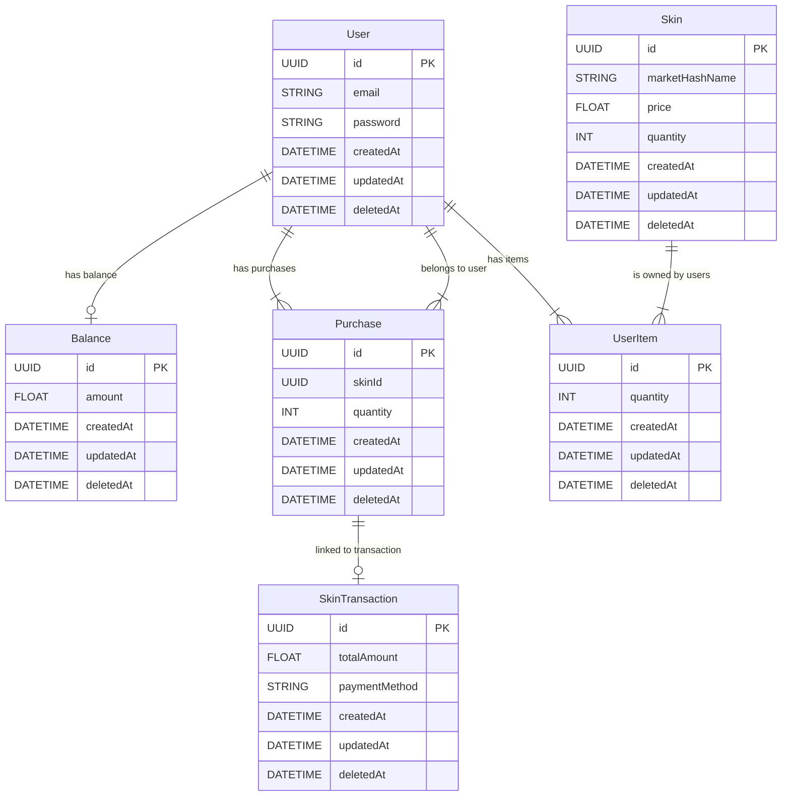

# 🛡️ Описание сервиса аутентификации и покупок

Сервис предоставляет пользователям функциональность аутентификации и возможность покупки игровых скинов. Он использует JWT для безопасной авторизации и Redis для управления токенами.

## 🔐 Как работает авторизация

1. **Регистрация (Signup)**: Пользователь создает учетную запись, предоставляя необходимые данные.
2. **Вход (Sign In)**: Пользователь вводит свои учетные данные, сервис проверяет их и выдает JWT токены:
   - **Access Token**: Краткосрочный токен, действующий 2 минуты.
   - **Refresh Token**: Долгосрочный токен, хранящийся в Redis, который можно использовать для получения нового access токена.
3. **Выход (Sign Out)**: Пользователь может выйти из системы, что аннулирует все токены.

## 📋 Доступные эндпоинты

### 🔑 Эндпоинты аутентификации

- **POST** `/auth/signup`: 📝 Регистрация нового пользователя.
  - **Входные данные**:
    - 📧 `email`: строка (обязательное поле)
    - 🔑 `password`: строка (обязательное поле)

- **POST** `/auth/signin`: 🔓 Вход пользователя и получение токенов.
  - **Входные данные**:
    - 📧 `email`: строка (обязательное поле)
    - 🔑 `password`: строка (обязательное поле)

- **GET** `/auth/info`: 📄 Получение информации о пользователе. 
  - **Входные данные**: отсутствуют
  - 🔒 Требуется Bearer авторизация.

- **PATCH** `/auth/change-password`: 🔄 Изменение пароля пользователя.
  - **Входные данные**:
    - 🔑 `oldPassword`: строка (старый пароль, обязательное поле)
    - 🔑 `newPassword`: строка (новый пароль, обязательное поле)
  - 🔒 Требуется Bearer авторизация.

- **GET** `/auth/refresh`: 🔄 Обновление access токена с использованием refresh токена.
  - **Входные данные**: отсутствуют
  - 🔒 Требуется заголовок `refresh-token` с токеном, а также Bearer авторизация.

- **GET** `/auth/signout`: 🔒 Выход из системы.
  - **Входные данные**: отсутствуют
  - 🔒 Требуется Bearer авторизация.

### 💸 Эндпоинты для покупок

- **POST** `/purchase`: 💵 Покупка скина, включая информацию о платеже.
  - **Входные данные** (DTO: `BuySkinDto`):
    - 🎮 `skinId`: UUID (идентификатор скина, обязательное поле)
    - 📏 `quantity`: число (целое значение, минимальное значение 1, обязательное поле)
    - 💳 `paymentInfo`: объект `PaymentInfo`, обязательное поле:
      - 🏦 `method`: строка (метод оплаты, обязательное поле)
  - 🔒 Требуется Bearer авторизация.

### 🖌️ Эндпоинты для работы с скинами

- **GET** `/skinport/get-minimum-prices`: 🏷️ Получение минимальных цен на скины с внешнего API (Skinport).
  - **Входные данные** (DTO: `GetMinimumPricesForItemsDto`):
    - 🆔 `app_id`: число (идентификатор приложения, необязательное поле)
    - 💱 `currency`: строка (валюта, тип `Currency`, значение по умолчанию — `EUR`, необязательное поле)
    - 🔄 `tradable`: число (значение 0 или 1, указывает, является ли скин торгуемым, необязательное поле)
  - 🔒 Требуется Bearer авторизация.
  
## 📊 ER-диаграмма для сервиса

### 📐 ER-диаграмма

## ✅ Заключение

Если что то не так, можете плз написать комменты в hh или в git 😊
