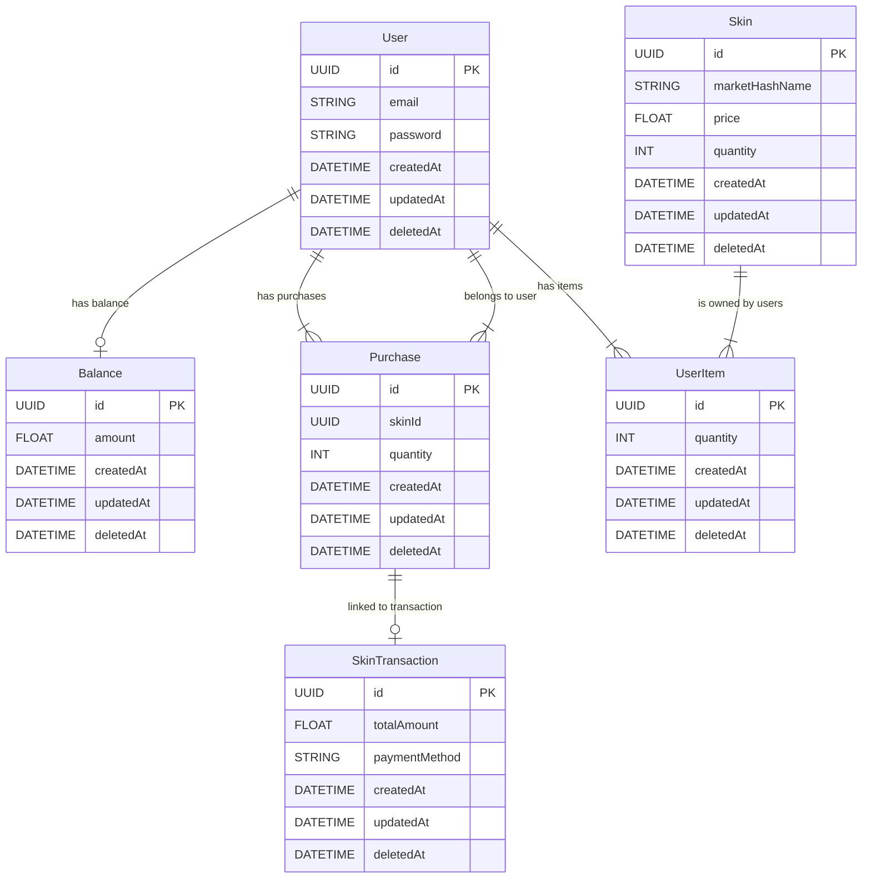

# Описание сервиса аутентификации и покупок

Сервис предоставляет пользователям функциональность аутентификации и возможность покупки игровых скинов. Он использует JWT для безопасной авторизации и Redis для управления токенами.

## Как работает авторизация

1. **Регистрация (Signup)**: Пользователь создает учетную запись, предоставляя необходимые данные.
2. **Вход (Sign In)**: Пользователь вводит свои учетные данные, сервис проверяет их и выдает JWT токены:
   - **Access Token**: Краткосрочный токен, действующий 2 минуты.
   - **Refresh Token**: Долгосрочный токен, хранящийся в Redis, который можно использовать для получения нового access токена.
3. **Выход (Sign Out)**: Пользователь может выйти из системы, что аннулирует все токены.

## Доступные эндпоинты

### Эндпоинты аутентификации
- `POST /auth/signup`: Регистрация нового пользователя.
- `POST /auth/signin`: Вход пользователя и получение токенов.
- `GET /auth/info`: Получение информации о пользователе.
- `PATCH /auth/change-password`: Изменение пароля пользователя.
- `GET /auth/refresh`: Обновление access токена с использованием refresh токена.
- `GET /auth/signout`: Выход из системы.

### Эндпоинты для покупок
- `POST /purchase`: Покупка скина, включая информацию о платеже.
  
### Эндпоинты для работы с скинами
- `GET /skinport/get-minimim-prices`: Получение минимальных цен на скины с внешнего API (Skinport).

# ER-диаграмма для сервиса

## ER-диаграмма

## Заключение

Если что то не так, можете плз написать комменты в hh или в git :)
